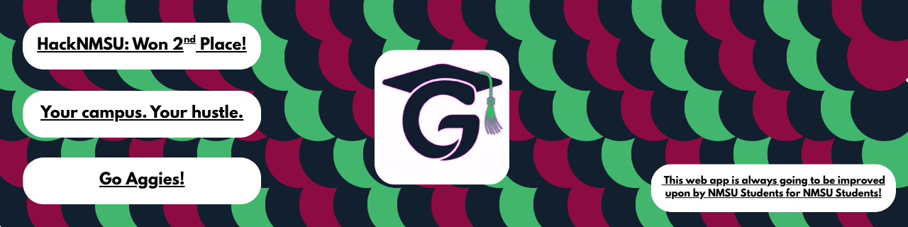

<!-- markdownlint-disable MD033 MD041 -->

  

# GetCampusGig

**Small gigs. Big campus energy.**

Post a task. Pick one up. Earn rep — built for **NMSU** students.

---

Hey — I’m an NMSU student and I helped build this with the team. We took **2nd** at a hackathon, and we
kept going because that’s already how campus works: coffee runs, notes, errands — the little favors
you’d normally hit someone’s DMs for. We also pitched it to a room of 50+ people, and about half said
they’d use something like this — so we’re building **GetCampusGig** to see if that holds up in the wild.

Basically it’s those favors, but on rails: post a gig or grab one, finish it, review each other. **Rep** only really counts here because you sign in with **@nmsu.edu** — it’s people from class, not randos online.

## What you can do

- Look around campus gigs or post your own.
- Someone accepts your request → you do the gig → you both leave reviews.
- Rep and a leaderboard if you want to care about that.

**Tech:** React, Supabase, Vercel. Nothing fancy — we wanted to ship.

**Try it:** [getcampusgig.com](https://www.getcampusgig.com)

## Put it on your phone (web app)

### iPhone (Safari)

1. Go to [getcampusgig.com](https://www.getcampusgig.com) in **Safari**.
2. Create account / Sign in. Ensure you see bottom navigation bar.
3. Hit **Share** (square with the arrow).
4. **Add to Home Screen**.
5. **Add**. Now it sits on your home screen like a normal app.

### Android (Chrome)

1. Same link in **Chrome**.
2. Create account / Sign in. Ensure you see bottom navigation bar.
3. **⋮** top right.
4. **Add to Home screen** or **Install app** (depends on the phone).
5. Confirm. Same idea — icon with everything else.

## How to use it

1. Should be logged in with **@nmsu.edu**.
2. Scroll gigs or make one.
3. See something you want? Request it. They accept. Do the work. Mark it done. Leave reviews.
4. Your **Rep** moves; poke around **profile** / **leaderboard** if that’s your thing.

**Community:** Use **Discussions** on this repo for questions, ideas, and “how do I…?” stuff — public, searchable, and easier than random DMs. If you want to help build **GetCampusGig**, that’s the place to say hi. Don’t share phone numbers, full convos, or anything you wouldn’t want on GitHub.
