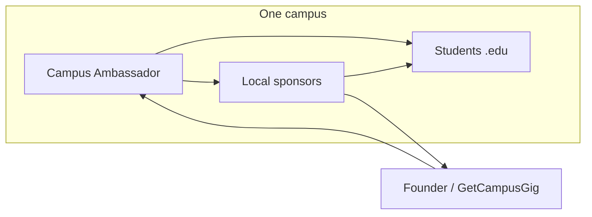

# Multi-Campus Expansion Plan (Later)

**GetCampusGig** · https://getcampusgig.com  
**When to use this doc:** After NMSU is working — not before.  
**Prerequisite playbook:** [`launch-plan-nmsu.md`](./launch-plan-nmsu.md)

---

## Vision (why expand at all)

Each college is its own **small city**. Students should:

- Find **campus gigs** safely (`.edu` only, contact after accept).
- Discover **local** restaurants, shops, and services — not only chains — through deals tied to their school.
- Feel like they’re **living like a local**, not just on a generic app.

**One sentence for partners and ambassadors:**

> GetCampusGig is the campus gig marketplace for your school — plus local deals from businesses that actually want college students.

Expansion means **copying the NMSU playbook** on new campuses, with a **Campus Ambassador** who owns growth + local sponsorships in their city.

---

## Do not expand until NMSU passes this gate

| Gate | Target | Why |
|------|--------|-----|
| Completed gigs (total) | **30+** | Marketplace proof |
| Completed gigs / week | **5+ for 2 weeks straight** | Ongoing liquidity |
| Organic usage | **≥1 gig** from someone you didn’t recruit personally | Not just friends |
| Ops | You can **support users** (bugs, reports) within 24–48h | You’re the founder, not firefighting |

Optional but strong signals before campus #2:

| Signal | Target |
|--------|--------|
| Signups (`@nmsu.edu`) | 100+ |
| Local sponsors (pilot, even informal) | 2–3 businesses willing to offer a student discount |
| Deals tab spec written | See [Product work before campus #2](#product-work-before-campus-2) |

**Rule:** If NMSU still feels empty, **fix NMSU**. A second campus doubles confusion, not success.

---

## Expansion phases (timeline)

| Phase | When | Focus |
|-------|------|--------|
| **0 — NMSU only** | Now → gate met | Liquidity, brand, seed gigs, tabling ([launch plan](./launch-plan-nmsu.md)) |
| **1 — NMSU sponsors** | After gate + ~100 signups | 3–5 local Las Cruces partners; prove students use deals |
| **2 — Campus #2 pilot** | 1 school, 1 ambassador | UNM, UTEP, NMT, or TX school you have a warm contact at |
| **3 — Playbook repeat** | Campus #2 hits same gates | Campus #3, #4 — never more than **1 new campus per semester** early on |
| **4 — Regional network** | Many campuses + sponsor revenue | Paid Campus Ambassadors, Deals tab per campus, light central ops |

You are in **Phase 0** until the gate table is checked off.

---

## Per-campus model

Each campus gets:

| Role | Responsibility |
|------|----------------|
| **You (founder)** | Product, legal tone, brand, payouts, hiring/firing ambassadors, final sponsor contracts |
| **Campus Ambassador** | Posters, tabling, club outreach, seed gigs, **local business conversations**, weekly metrics |
| **Local businesses** | Discount or perk for students (shown in app); pay you for visibility when ready |

---

## Local sponsorships — “live like a local”

### What students see (future product)

A **Deals** (or **Local**) tab per campus:

- Coffee, food, barber, print shop, gym, boba — **owner-operated** near campus first.
- Offer examples: 10% off, free drink with purchase, student night, “show app profile.”
- **No payment processing in v1** — business honors deal at counter; you track redemptions loosely or on honor system.

### What businesses get

- Listed in app for **their** campus only.
- Instagram shoutout from campus account.
- Access to students who already use gigs (engaged locals).

### What you charge (when ready — not day one)

Start simple; raise prices when you have numbers.

| Tier | Example price | Includes |
|------|----------------|----------|
| **Pilot** | $0 for 3 months | 1 deal line + logo; you need proof for the next tier |
| **Local partner** | $50–150 / month per campus | Logo, deal in app, 1 post/month |
| **Featured** | $200–400 / month | Top of Deals tab + table collateral at events |

Adjust for Las Cruces vs Albuquerque market. **First 2–3 sponsors at NMSU can be free** to get case studies.

### Ambassador’s job with restaurants / shops

1. Build a list of 20 targets within **1 mile of campus** (walkable).
2. Visit or call with the script below.
3. Log in shared tracker: business name, contact, status, offer, monthly fee.
4. Send you photos of signed verbal OK or simple email agreement before you list them.

**Pitch script (ambassador):**

> Hi, I’m the campus ambassador for GetCampusGig at [SCHOOL] — it’s a student-only gig app with [NUMBER] students on campus. We’re partnering with a few local spots students already love. Would you do a simple student discount — like 10% off — if we feature you in the app and on our Instagram? We have a free pilot for the first three partners.

---

## How to get ambassadors at other colleges

You do **not** need a huge network. You need **one reliable person per campus** who is already embedded.

### Where to find them

| Source | Why it works |
|--------|----------------|
| **Friends at other schools** | Fast trust; know if they’ll actually work |
| **NMSU transfers / hometown friends** | Already know you |
| **Club officers** (entrepreneurship, CS, business) | Used to organizing |
| **Reddit / Discord** for target school | Last resort — vet hard |
| **LinkedIn** “Student at UNM” + cold DM | Slow; use after you have NMSU stats |

### What to look for

- [ ] Willing to **do in-person** work (posters, tabling, walking into shops).
- [ ] On campus **≥2 semesters** left.
- [ ] Responsive on text (replies within a day during launch month).
- [ ] Not only “ideas person” — has posted in group chats / run something small before.

### What to avoid

- Someone who only wants a resume line and ghosts after week 1.
- Multiple ambassadors on one campus before the first proves themselves.
- Paying upfront with no revenue (see compensation below).

### Recruitment message (copy/paste)

> Hey — I built GetCampusGig, a campus gig app that’s live at NMSU with [X] completed gigs. I’m opening [THEIR SCHOOL] next semester and looking for one campus ambassador: posters, tabling, talking to local businesses for student deals, and helping seed gigs the first two weeks. It’s unpaid at first; once we have local sponsors paying for listings, ambassadors earn a cut of deals they close. Interested in a 15-min call?

### Interview (15 minutes)

1. What clubs / dorms / jobs do you have access to?
2. Can you post 5 seed gigs in week 1 with friends?
3. Comfortable walking into 5 local businesses?
4. How many hours/week for the first month? (expect **5–10** during launch, **2–4** after)

### Onboarding checklist (new campus)

- [ ] Add their school to allowed email domain (product/DB — when you build multi-campus).
- [ ] Send poster PDF + scripts from [launch plan](./launch-plan-nmsu.md).
- [ ] Shared tracker: signups, gigs, completions, sponsor pipeline.
- [ ] Weekly 20-min call with you for first 4 weeks.
- [ ] They do **not** get admin/DB access — only marketing + outreach role.

---

## Paying ambassadors — when and how

**Principle:** You pay ambassadors **from money businesses pay you**, not from your pocket long-term. Early NMSU helpers can be coffee + credit until revenue exists.

### Stage A — Volunteer / founding (NMSU now, campus #2 week 1)

| You give | They give |
|----------|-----------|
| Coffee, meals, “founding ambassador” shoutout | Posters, seed gigs, tabling, honest weekly update |
| Optional: small gift card per **completed campus milestone** | e.g. $10 coffee card at 10 completions |

**No cash salary** until sponsor revenue or you choose to subsidize one launch month.

### Stage B — Revenue share (first sponsor dollars)

When a business pays **$X/month** (or one-time semester fee):

| Party | Suggested split (adjust in writing) |
|-------|-------------------------------------|
| **Business** | Gets listing + deal in app |
| **You / company** | **60–70%** — product, hosting, brand, liability buffer |
| **Ambassador who closed the deal** | **30–40%** of that business’s fee for **6–12 months** |

Example: Coffee shop pays **$100/mo** → ambassador **$30–40/mo**, you **$60–70/mo**.

If two ambassadors helped, split the ambassador portion or assign primary closer in a simple agreement.

### Stage C — Campus manager stipend (campus is mature)

When **one campus** has:

- 5+ completions/week sustained, AND  
- **3+ paying sponsors**, AND  
- **150+ signups**

Consider a fixed **$200–400/month stipend** plus lower rev-share on new deals — rewards ops, not only sales.

### What to put in a simple agreement (later, not legal advice)

- Territory: one school + city radius for sponsors.
- Commission % and duration on each signed business.
- They represent GetCampusGig honestly; no fake users or spam.
- Either side can end with 2 weeks notice.
- They are **contractor / independent**, not employee (keep it simple until you hire for real).

Get a parent-school legal clinic or small-business attorney once money is non-trivial.

---

## Campus rollout playbook (each new school)

Copy NMSU week-by-week from [`launch-plan-nmsu.md`](./launch-plan-nmsu.md). Differences:

| Step | Owner | Notes |
|------|--------|-------|
| Confirm `.edu` domain in product | You | e.g. `@unm.edu` — requires schema/auth work |
| Hire 1 ambassador | You | Before posters print |
| Seed 10–15 gigs | Ambassador + friends | First 2 weeks |
| Posters + tabling | Ambassador | You review poster copy for brand |
| Sponsor outreach (5 businesses) | Ambassador | Start week 3–4 of semester |
| Deals go live in app | You | After 2–3 signed pilots |
| Gate for campus #3 | You | Same metrics as NMSU gate |

**Pace:** Max **one new campus per semester** until you have a part-time ops rhythm.

---

## Product work before campus #2

Not implemented today — plan before you promise UNM students a Deals tab:

| Item | Why |
|------|-----|
| Multi-domain email allowlist | `@nmsu.edu` today → add `@unm.edu`, etc. |
| `campus_id` or school on user + gig | Filter Explore/Deals by campus |
| Deals / Sponsors tab per campus | Local offers only where you study |
| Ambassador cannot access Supabase | Security — outreach role only |
| Simple sponsor admin (spreadsheet OK at first) | Business name, offer, expiry, campus |

Track shipped items in `docs/future-plans/README.md`.

---

## Suggested campus order (Southwest — example only)

Pick schools where **you** have a warm ambassador, not just a big name.

| Priority | School | Domain | Notes |
|----------|--------|--------|-------|
| 1 | NMSU | `@nmsu.edu` | Home campus — must pass gate first |
| 2 | Your choice | `@unm.edu`, `@utep.edu`, `@nmt.edu`, etc. | One pilot with proven ambassador |
| 3+ | Adjacent states / similar culture | varies | Same playbook |

---

## Metrics per campus (track in one spreadsheet)

| Campus | Ambassador | Signups | Completions/wk | Paying sponsors | MRR from campus |
|--------|------------|---------|----------------|-----------------|-----------------|
| NMSU | (you / name) | | | | |
| Campus 2 | | | | | |

**MRR** = monthly recurring revenue from local businesses at that campus.

---

## Founder checklist — “am I ready to expand?”

- [ ] NMSU gate table passed ([top of this doc](#do-not-expand-until-nmsu-passes-this-gate))
- [ ] At least 2 NMSU local sponsors (paid or successful free pilot with foot traffic story)
- [ ] Campus #2 ambassador vetted and committed for launch month
- [ ] Multi-campus email + campus filter scoped in product (or clear manual workaround documented)
- [ ] Simple commission terms agreed in writing with ambassador
- [ ] You can afford **$0 salary** if sponsors are slow — ambassador knows Stage A → B timeline

---

## Related docs

- **Now:** [`launch-plan-nmsu.md`](./launch-plan-nmsu.md) — posters, tabling, seed gigs, NMSU sponsors Phase 3  
- **Product ideas:** [`future-plans/README.md`](./future-plans/README.md)  
- **Overview:** [`first.md`](./first.md)

---

**Last updated:** 2026 — update gates and $ amounts when NMSU has real numbers.
